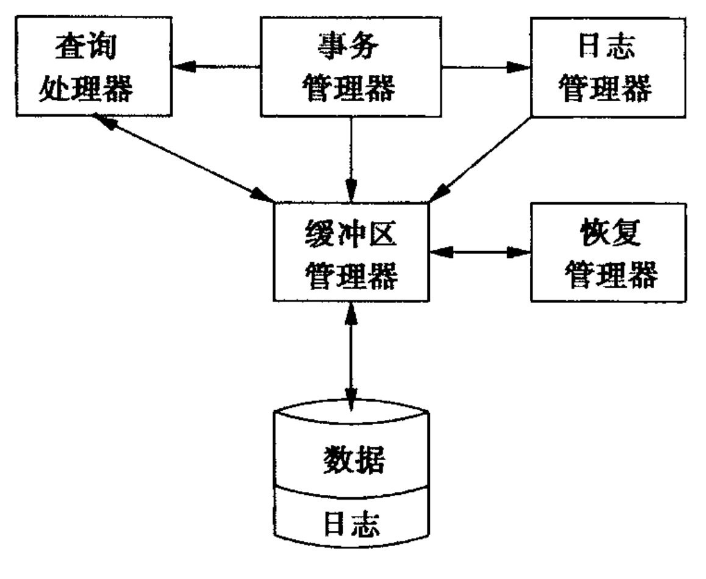

# 第6章 系统故障对策
本章讲诉支持可恢复性这一目标的相应技术。支持可恢复性的基础技术是**日志**。3种不同类型的**日志**：

* **undo**
* **redo**
* **undo/redo**

“检查点”技术限制了恢复时必须检查的日志长度。

## 6.1 可恢复操作的问题和模型

### 6.1.1  故障模式

* 错误数据输入：主要技术就是编写**约束**和**触发器**
* 介质故障：采用RAID模式；维护一个备份
* 灾难性故障（数据库所在地点发生大爆炸或者大火等恶意破坏）：备份、冗余、分布的拷贝
* 系统故障（掉电和软件错误）：在分离的、非易失性的日志中记录所有数据库更新，必要时加以恢复。

### 6.1.2 关于事务的进一步讨论

在SQL语句中，事务使用以下命令显式表示：

* **COMMIT**
* **ROLLBACK**

事务必须原子执行，即全做或全不做。**事务管理器**保证事务正确执行，应包括功能：

1. 给**日志管理器**发信号，使必需的信息能以“日志记录”的形式存储在日志中。
2. 保证**并发**执行的事务不会以引入错误的方式相互干扰（见 7.1节“调度”）

如下图所示，为日志管理器与事务管理器。

### 6.1.3 事务的正确执行

数据库由“元素”组成，元素可以是以下这些表达：

1. 关系。
2. 磁盘块或页。
3. 关系中的单个元组或对象。

​	**正确性原则**：如果事务在没有其他任何事务和系统错误的情况下执行，并且在它开始执行时数据库处于一致的状态，那么当事务结束时数据库仍然处于一致的状态。

### 6.1.4 事务的原语操作

事务与数据库交互。有3个地址空间：

1. 保存数据库元素的磁盘快空间。
2. 缓存区管理器所管理的虚存或主存地址空间。
3. 事务的局部地址空间。

有以下**原语**：

1. **INPUT(X)**：将包含数据库元素X的磁盘块拷贝到主存缓冲区。
2. **READ(X, t)**：将数据库元素X拷贝到事务的局部变量t。更准确地说，如果包含数据库元素X的块不在主存缓冲区中，则首先执行INPUT(X)，接着将X的值赋给局部变量t。
3. **WRITE(X, t)**：将局部变量t的值拷贝到主存缓冲区的数据库元素X。更准确的说，如果包含数据库元素X的块不在主缓存区中，则先执行INPUT(X)，接着将t的值拷贝到缓冲区的X。
4. **OUTPUT(X)**：将包含X的缓冲区中的块拷贝回磁盘。  

